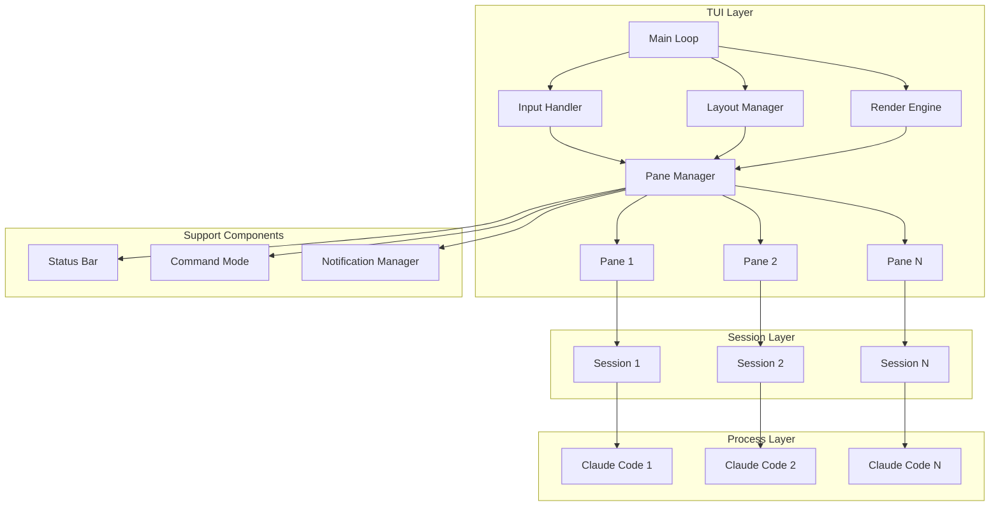

# Multiplexer TUI Design Document

## Overview

The Multiplexer TUI provides a terminal-based interface for managing multiple Claude Code sessions simultaneously. Built on NCurses, it offers a tiled window manager experience within the terminal, allowing developers to work with multiple Claude Code instances efficiently. The design emphasizes keyboard-driven workflows, visual clarity, and seamless integration with the existing session management infrastructure.

## Architecture

### High-level Architecture
```
┌─────────────────────────────────────────────────────────┐
│                    TUI Main Loop                         │
│  ┌─────────────┐  ┌──────────────┐  ┌────────────────┐ │
│  │Input Handler│  │Layout Manager│  │ Render Engine  │ │
│  └──────┬──────┘  └──────┬───────┘  └────────┬───────┘ │
│         │                │                    │         │
│  ┌──────▼──────────────────────────────────────┐       │
│  │            Pane Manager                      │       │
│  │  ┌────────┐  ┌────────┐  ┌────────┐        │       │
│  │  │ Pane 1 │  │ Pane 2 │  │ Pane N │  ...   │       │
│  │  └────┬───┘  └────┬───┘  └────┬───┘        │       │
│  └───────┼───────────┼───────────┼─────────────┘       │
│          │           │           │                      │
└──────────┼───────────┼───────────┼──────────────────────┘
           │           │           │
    ┌──────▼───┐ ┌────▼────┐ ┌───▼─────┐
    │ Session  │ │ Session │ │ Session │
    │ Manager  │ │ Manager │ │ Manager │
    └──────────┘ └─────────┘ └─────────┘
           │           │           │
    ┌──────▼───┐ ┌────▼────┐ ┌───▼─────┐
    │  Claude  │ │ Claude  │ │ Claude  │
    │   Code   │ │  Code   │ │  Code   │
    └──────────┘ └─────────┘ └─────────┘
```

### Architecture Diagram


## Components and Interfaces

### Component 1: TUI Main Loop
- **Purpose:** Orchestrates the event loop and coordinates all TUI components
- **Responsibilities:** 
  - Initialize NCurses environment
  - Handle terminal resize events
  - Coordinate input, layout, and rendering
  - Manage TUI lifecycle
- **Interfaces:** 
  - `app_tui_init()`: Initialize TUI
  - `app_tui_run()`: Start event loop
  - `app_tui_shutdown()`: Clean shutdown
- **Dependencies:** NCurses library, all TUI components

### Component 2: Input Handler
- **Purpose:** Processes keyboard and mouse input events
- **Responsibilities:**
  - Capture raw input from terminal
  - Translate key sequences to commands
  - Handle mouse events if enabled
  - Manage input modes (normal, command, insert)
- **Interfaces:**
  - `app_input_process_key(int ch)`: Process keyboard input
  - `app_input_process_mouse(MEVENT* event)`: Process mouse input
  - `app_input_set_mode(input_mode_t mode)`: Change input mode
- **Dependencies:** NCurses input functions, Command dispatcher

### Component 3: Layout Manager
- **Purpose:** Manages pane arrangement and sizing
- **Responsibilities:**
  - Calculate pane dimensions based on layout mode
  - Handle pane splitting and closing
  - Manage focus transitions
  - Respond to terminal resize
- **Interfaces:**
  - `app_layout_arrange(layout_mode_t mode)`: Arrange panes
  - `app_layout_split(direction_t dir)`: Split current pane
  - `app_layout_resize_pane(pane_id_t id, int delta)`: Resize pane
- **Dependencies:** Pane Manager, terminal dimensions

### Component 4: Pane Manager
- **Purpose:** Manages individual panes and their content
- **Responsibilities:**
  - Create and destroy panes
  - Route input to active pane
  - Manage pane state and metadata
  - Handle pane-specific rendering
- **Interfaces:**
  - `app_pane_create(account_id_t account)`: Create new pane
  - `app_pane_focus(pane_id_t id)`: Focus pane
  - `app_pane_close(pane_id_t id)`: Close pane
  - `app_pane_get_content(pane_id_t id)`: Get pane content
- **Dependencies:** Session Manager, Account Manager

### Component 5: Render Engine
- **Purpose:** Handles all screen drawing operations
- **Responsibilities:**
  - Draw pane borders and content
  - Update status bars
  - Display notifications
  - Optimize screen updates
- **Interfaces:**
  - `app_render_frame()`: Render complete frame
  - `app_render_pane(pane_id_t id)`: Render single pane
  - `app_render_status_bar()`: Update status bar
- **Dependencies:** NCurses drawing functions, Pane Manager

## Data Models

### Pane Structure
```c
typedef struct {
    pane_id_t id;
    WINDOW* window;  // NCurses window
    WINDOW* border_window;  // Border decoration
    session_id_t session_id;
    account_id_t account_id;
    pane_state_t state;  // ACTIVE, BUSY, ERROR, INACTIVE
    rect_t geometry;  // Position and size
    char* title;
    time_t last_activity;
    bool has_focus;
} app_pane_t;
```

### Layout Configuration
```c
typedef struct {
    layout_mode_t mode;  // GRID, VSPLIT, HSPLIT, FOCUS
    int rows;
    int cols;
    pane_id_t* pane_order;  // Array of pane IDs
    size_t pane_count;
    pane_id_t focused_pane;
} app_layout_t;
```

### Multiplexer State
```c
typedef struct {
    char* workspace_id;
    app_layout_t* layout;
    app_pane_t** panes;
    size_t pane_count;
    command_history_t* cmd_history;
    keybinding_map_t* keybindings;
    bool mouse_enabled;
    color_scheme_t* colors;
} app_mux_state_t;
```

### Workspace Schema (`~/.cache/fry/workspaces/{workspace_id}.json`)
```json
{
  "workspace_id": "work_abc123",
  "name": "Development",
  "created_at": "2024-01-20T10:00:00Z",
  "last_active": "2024-01-20T15:45:00Z",
  "layout": {
    "mode": "grid",
    "dimensions": {"rows": 2, "cols": 2},
    "panes": [
      {
        "id": "pane_001",
        "position": {"row": 0, "col": 0},
        "account_id": "acc_personal",
        "session_id": "sess_123",
        "size_weight": 1.0
      },
      {
        "id": "pane_002",
        "position": {"row": 0, "col": 1},
        "account_id": "acc_work",
        "session_id": "sess_456",
        "size_weight": 1.0
      }
    ]
  },
  "keybindings": {
    "custom": {
      "ctrl-p": "command:switch-pane",
      "ctrl-n": "command:new-pane"
    }
  }
}
```

## Error Handling

### Error Recovery Strategy
1. **Pane-level isolation**: Errors in one pane don't affect others
2. **Graceful degradation**: Fall back to simpler rendering if terminal lacks capabilities
3. **User notification**: Non-intrusive error messages in notification area
4. **Automatic recovery**: Attempt to restart failed sessions
5. **Debug logging**: Detailed logs for troubleshooting

### Error Types and Responses
```c
typedef enum {
    MUX_ERR_NONE = 0,
    MUX_ERR_TERM_TOO_SMALL,     // Suggest minimum size
    MUX_ERR_NO_COLOR,           // Fall back to monochrome
    MUX_ERR_SESSION_DIED,       // Offer restart
    MUX_ERR_ACCOUNT_LIMITED,    // Show cooldown timer
    MUX_ERR_NO_ACCOUNTS,        // Prompt to add account
    MUX_ERR_RENDER_FAILED       // Try simpler rendering
} mux_error_t;
```

## Testing Strategy

### Unit Testing Approach
- Mock NCurses functions for testing without terminal
- Test layout calculations with various terminal sizes
- Verify input handling for all key combinations
- Test error recovery scenarios

### Integration Testing
- Test with real Claude Code processes
- Verify account rotation under rate limits
- Test workspace save/restore
- Validate mouse interactions

### Performance Testing
- Measure render performance with maximum panes
- Test input latency under load
- Verify CPU usage when idle
- Benchmark terminal resize handling

## Design Decisions and Rationale

### 1. NCurses over Alternative TUI Libraries
**Decision:** Use NCurses despite its complexity
**Rationale:** 
- Mature, well-tested library
- Excellent terminal compatibility
- No external dependencies
- Fine-grained control over rendering

### 2. Pseudo-terminal (PTY) for Claude Code
**Decision:** Each pane runs Claude Code in a PTY
**Rationale:**
- Full terminal emulation for Claude Code
- Proper signal handling
- Natural scrollback buffer
- Standard I/O redirection

### 3. Event-Driven Architecture
**Decision:** Single-threaded event loop
**Rationale:**
- Simpler than multi-threading
- Avoids NCurses thread-safety issues
- Predictable behavior
- Easier debugging

### 4. Workspace Persistence
**Decision:** JSON-based workspace files
**Rationale:**
- Human-readable format
- Easy to version control
- Simple backup/restore
- Extensible schema

## Future Considerations

### Potential Extensions
1. **Plugin System**: Allow custom pane types (logs, metrics, etc.)
2. **Remote Sessions**: Connect to Claude Code on remote machines
3. **Collaborative Mode**: Share multiplexer sessions with team members
4. **Recording/Playback**: Record and replay entire sessions
5. **Advanced Layouts**: Tabbed panes, floating windows
6. **Scripting API**: Automate multiplexer operations

### Scalability Considerations
- Consider moving to async I/O for better performance
- Implement virtual pane scrolling for > 9 panes
- Add pane groups for organizing many sessions
- Consider GPU-accelerated rendering for modern terminals