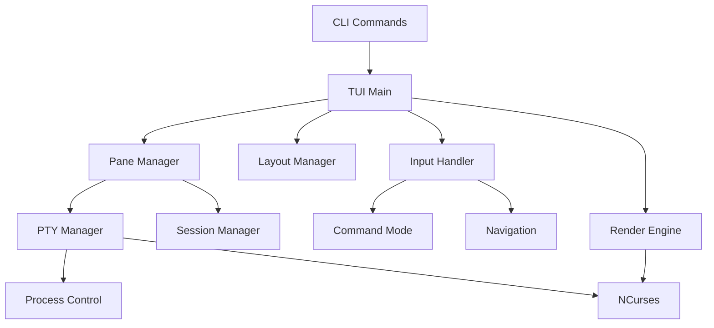

# Multiplexer TUI Implementation Plan

## Executive Summary

This implementation plan outlines the development of the Multiplexer TUI feature for the fry CLI tool. The TUI will provide an NCurses-based interface for managing multiple Claude Code sessions in a tiled layout. The implementation is divided into 5 phases over approximately 10-12 weeks, building upon the existing session multiplexing infrastructure.

## Development Phases

### Phase 1: NCurses Foundation & Basic Panes (Week 1-2)
**Goal**: Establish NCurses infrastructure and basic pane rendering

**Milestones**:
- NCurses initialization and cleanup working
- Basic pane creation and rendering
- Simple grid layout functional

**Dependencies**: Session multiplexing feature complete

**Risk Factors**:
- NCurses compatibility across platforms
- Terminal capability detection issues

### Phase 2: PTY Integration & Process Management (Week 3-4)
**Goal**: Integrate pseudo-terminals for Claude Code processes

**Milestones**:
- PTY creation and management working
- Claude Code processes running in panes
- I/O redirection functional

**Dependencies**: Phase 1 completion

**Risk Factors**:
- Platform-specific PTY implementations
- Signal handling complexity

### Phase 3: Input Handling & Navigation (Week 5-6)
**Goal**: Implement keyboard and mouse input processing

**Milestones**:
- Keyboard navigation working
- Command mode implemented
- Mouse support functional

**Dependencies**: Phase 2 completion

**Risk Factors**:
- Complex key sequence handling
- Mouse support varies by terminal

### Phase 4: Layout Management & UI Polish (Week 7-9)
**Goal**: Advanced layouts and visual enhancements

**Milestones**:
- Multiple layout modes working
- Dynamic resizing functional
- Status bars and notifications

**Dependencies**: Phase 3 completion

**Risk Factors**:
- Layout calculation complexity
- Performance with many panes

### Phase 5: Persistence & Testing (Week 10-12)
**Goal**: Workspace persistence and comprehensive testing

**Milestones**:
- Workspace save/restore working
- Full test coverage
- Documentation complete

**Dependencies**: Phases 1-4 complete

**Risk Factors**:
- Edge cases in session restoration
- Cross-platform testing challenges

## Task Breakdown

### Phase 1 Tasks

```
Task ID: [FRY-MUX-001]
Title: Create NCurses abstraction layer
Description: Design wrapper around NCurses for easier testing
Acceptance Criteria:
- [ ] Initialize/shutdown NCurses properly
- [ ] Handle terminal capabilities detection
- [ ] Provide mock implementation for tests
- [ ] Support both color and monochrome
Dependencies: None
Estimated Effort: 6 hours
Priority: High
Assigned Skills: C programming, NCurses
```

```
Task ID: [FRY-MUX-002]
Title: Implement basic pane structure
Description: Create pane data structures and management
Acceptance Criteria:
- [ ] Pane creation and destruction
- [ ] Window association per pane
- [ ] Border rendering with state colors
- [ ] Content area calculation
Dependencies: [FRY-MUX-001]
Estimated Effort: 8 hours
Priority: High
Assigned Skills: C programming, Data structures
```

```
Task ID: [FRY-MUX-003]
Title: Create grid layout manager
Description: Implement automatic grid layout for panes
Acceptance Criteria:
- [ ] Calculate optimal grid dimensions
- [ ] Position panes in grid
- [ ] Handle various pane counts (1-9)
- [ ] Maintain aspect ratios
Dependencies: [FRY-MUX-002]
Estimated Effort: 8 hours
Priority: High
Assigned Skills: Algorithm design, UI layout
```

```
Task ID: [FRY-MUX-004]
Title: Implement render engine
Description: Create efficient screen rendering system
Acceptance Criteria:
- [ ] Full screen refresh
- [ ] Partial update optimization
- [ ] Double buffering if needed
- [ ] Flicker-free rendering
Dependencies: [FRY-MUX-002]
Estimated Effort: 10 hours
Priority: High
Assigned Skills: NCurses, Performance optimization
```

```
Task ID: [FRY-MUX-005]
Title: Add basic event loop
Description: Main loop for handling events and rendering
Acceptance Criteria:
- [ ] Non-blocking input handling
- [ ] Terminal resize detection
- [ ] Refresh rate control
- [ ] Clean shutdown handling
Dependencies: [FRY-MUX-001], [FRY-MUX-004]
Estimated Effort: 6 hours
Priority: High
Assigned Skills: Event-driven programming
```

### Phase 2 Tasks

```
Task ID: [FRY-MUX-006]
Title: Implement PTY management
Description: Create pseudo-terminal handling for processes
Acceptance Criteria:
- [ ] PTY creation cross-platform
- [ ] Proper terminal settings
- [ ] Signal forwarding
- [ ] Clean PTY cleanup
Dependencies: None
Estimated Effort: 12 hours
Priority: High
Assigned Skills: POSIX, Terminal emulation
```

```
Task ID: [FRY-MUX-007]
Title: Integrate Claude Code launching
Description: Launch Claude Code processes in PTYs
Acceptance Criteria:
- [ ] Process creation with auth
- [ ] Environment variable setup
- [ ] Working directory handling
- [ ] Process monitoring
Dependencies: [FRY-MUX-006], Session management
Estimated Effort: 8 hours
Priority: High
Assigned Skills: Process management
```

```
Task ID: [FRY-MUX-008]
Title: Implement I/O multiplexing
Description: Handle I/O between PTYs and panes
Acceptance Criteria:
- [ ] Non-blocking I/O
- [ ] Buffer management
- [ ] Scrollback support
- [ ] ANSI escape sequence handling
Dependencies: [FRY-MUX-006], [FRY-MUX-002]
Estimated Effort: 10 hours
Priority: High
Assigned Skills: I/O programming, select/poll
```

```
Task ID: [FRY-MUX-009]
Title: Add process lifecycle management
Description: Handle process death and restart
Acceptance Criteria:
- [ ] Detect process exit
- [ ] Display exit status
- [ ] Restart capability
- [ ] Zombie process cleanup
Dependencies: [FRY-MUX-007]
Estimated Effort: 6 hours
Priority: Medium
Assigned Skills: Signal handling
```

### Phase 3 Tasks

```
Task ID: [FRY-MUX-010]
Title: Implement keyboard input system
Description: Process keyboard input and shortcuts
Acceptance Criteria:
- [ ] Raw mode input handling
- [ ] Key sequence parsing
- [ ] Configurable keybindings
- [ ] Multi-key sequences (e.g., Ctrl-W)
Dependencies: [FRY-MUX-005]
Estimated Effort: 10 hours
Priority: High
Assigned Skills: Terminal I/O, Input handling
```

```
Task ID: [FRY-MUX-011]
Title: Add navigation commands
Description: Implement pane navigation and focus
Acceptance Criteria:
- [ ] Vim-style navigation (hjkl)
- [ ] Tab cycling
- [ ] Numbered pane jump (Alt+N)
- [ ] Focus indication
Dependencies: [FRY-MUX-010]
Estimated Effort: 6 hours
Priority: High
Assigned Skills: UI navigation
```

```
Task ID: [FRY-MUX-012]
Title: Implement command mode
Description: Add command-line interface within TUI
Acceptance Criteria:
- [ ] Command mode activation (:)
- [ ] Command parsing
- [ ] Tab completion
- [ ] Command history
Dependencies: [FRY-MUX-010]
Estimated Effort: 12 hours
Priority: Medium
Assigned Skills: Parser implementation
```

```
Task ID: [FRY-MUX-013]
Title: Add mouse support
Description: Implement optional mouse interactions
Acceptance Criteria:
- [ ] Mouse event capture
- [ ] Click to focus
- [ ] Drag to resize
- [ ] Context menus
Dependencies: [FRY-MUX-001]
Estimated Effort: 8 hours
Priority: Low
Assigned Skills: NCurses mouse API
```

### Phase 4 Tasks

```
Task ID: [FRY-MUX-014]
Title: Implement split layouts
Description: Add vertical and horizontal split modes
Acceptance Criteria:
- [ ] Binary tree layout structure
- [ ] Split commands
- [ ] Proportional sizing
- [ ] Minimum size constraints
Dependencies: [FRY-MUX-003]
Estimated Effort: 10 hours
Priority: Medium
Assigned Skills: Tree algorithms, Layout
```

```
Task ID: [FRY-MUX-015]
Title: Add pane resizing
Description: Dynamic pane size adjustment
Acceptance Criteria:
- [ ] Keyboard resize commands
- [ ] Mouse drag resizing
- [ ] Maintain minimum sizes
- [ ] Proportional adjustment
Dependencies: [FRY-MUX-014]
Estimated Effort: 8 hours
Priority: Medium
Assigned Skills: Geometry calculations
```

```
Task ID: [FRY-MUX-016]
Title: Implement status bar
Description: Per-pane and global status information
Acceptance Criteria:
- [ ] Account name display
- [ ] Session state indicators
- [ ] Rate limit warnings
- [ ] Clock and system info
Dependencies: [FRY-MUX-004]
Estimated Effort: 6 hours
Priority: Medium
Assigned Skills: UI design
```

```
Task ID: [FRY-MUX-017]
Title: Add notification system
Description: Non-intrusive user notifications
Acceptance Criteria:
- [ ] Toast-style notifications
- [ ] Auto-dismiss timers
- [ ] Priority levels
- [ ] Notification history
Dependencies: [FRY-MUX-004]
Estimated Effort: 8 hours
Priority: Low
Assigned Skills: UI/UX design
```

```
Task ID: [FRY-MUX-018]
Title: Implement focus mode
Description: Maximize single pane temporarily
Acceptance Criteria:
- [ ] Toggle focus mode
- [ ] Restore previous layout
- [ ] Visual indicators
- [ ] Smooth transitions
Dependencies: [FRY-MUX-003]
Estimated Effort: 4 hours
Priority: Low
Assigned Skills: Layout management
```

### Phase 5 Tasks

```
Task ID: [FRY-MUX-019]
Title: Implement workspace persistence
Description: Save and restore multiplexer state
Acceptance Criteria:
- [ ] Save layout configuration
- [ ] Store pane assignments
- [ ] Restore on startup
- [ ] Named workspaces
Dependencies: All UI features
Estimated Effort: 10 hours
Priority: High
Assigned Skills: Serialization, File I/O
```

```
Task ID: [FRY-MUX-020]
Title: Add session reconnection
Description: Reconnect to existing Claude Code processes
Acceptance Criteria:
- [ ] Detect running processes
- [ ] Reattach to PTYs
- [ ] Restore buffer content
- [ ] Handle stale sessions
Dependencies: [FRY-MUX-019]
Estimated Effort: 12 hours
Priority: Medium
Assigned Skills: Process management, IPC
```

```
Task ID: [FRY-MUX-021]
Title: Create comprehensive test suite
Description: Unit and integration tests for TUI
Acceptance Criteria:
- [ ] Mock NCurses for unit tests
- [ ] Layout calculation tests
- [ ] Input handling tests
- [ ] Integration test harness
Dependencies: All features complete
Estimated Effort: 16 hours
Priority: High
Assigned Skills: Testing, Mocking
```

```
Task ID: [FRY-MUX-022]
Title: Performance optimization
Description: Optimize rendering and responsiveness
Acceptance Criteria:
- [ ] Profile rendering hotspots
- [ ] Optimize screen updates
- [ ] Reduce CPU usage when idle
- [ ] Memory usage optimization
Dependencies: All features complete
Estimated Effort: 12 hours
Priority: Medium
Assigned Skills: Profiling, Optimization
```

```
Task ID: [FRY-MUX-023]
Title: Write user documentation
Description: Complete docs for multiplexer features
Acceptance Criteria:
- [ ] Keybinding reference
- [ ] Layout mode guide
- [ ] Troubleshooting section
- [ ] Video tutorials
Dependencies: All features complete
Estimated Effort: 8 hours
Priority: High
Assigned Skills: Technical writing
```

## Development Sequence

### Critical Path
1. [FRY-MUX-001] → [FRY-MUX-002] → [FRY-MUX-006] → [FRY-MUX-007] → [FRY-MUX-008]

### Parallel Development Opportunities
- Phase 1: NCurses wrapper and PTY system can be developed in parallel
- Phase 3: Mouse support can be developed independently
- Phase 4: Status bar and notifications can be parallel work
- Phase 5: Documentation can start early

### Integration Points
1. **After Phase 1**: Basic TUI with static content
2. **After Phase 2**: Live Claude Code sessions in panes
3. **After Phase 3**: Full interactivity
4. **After Phase 4**: Complete UI features
5. **After Phase 5**: Production-ready multiplexer

## Code Organization

### Project Structure
```
src/
├── tui/
│   ├── tui.h               # Public TUI interface
│   ├── tui.c               # Main TUI implementation
│   ├── tui_pane.h          # Pane management
│   ├── tui_pane.c          # Pane implementation
│   ├── tui_layout.h        # Layout algorithms
│   ├── tui_layout.c        # Layout implementation
│   ├── tui_input.h         # Input handling
│   ├── tui_input.c         # Input implementation
│   ├── tui_render.h        # Rendering engine
│   ├── tui_render.c        # Render implementation
│   ├── tui_pty.h           # PTY management
│   ├── tui_pty.c           # PTY implementation
│   └── tui_commands.c      # Command mode handlers
├── cli/
│   └── cmd_mux.c           # CLI commands for multiplexer
└── utils/
    ├── terminal.h          # Terminal utilities
    └── terminal.c          # Terminal implementation
```

### Module Dependencies


## Testing Plan

### Unit Testing Strategy
- Mock NCurses functions for headless testing
- Test layout algorithms with various configurations
- Verify input sequence parsing
- Test PTY operations in isolation

### Integration Testing
- Automated TUI testing with expect/tmux
- Multi-platform terminal testing
- Performance benchmarks
- Stress testing with maximum panes

### Manual Testing Checklist
- [ ] All keybindings work as documented
- [ ] Mouse interactions (if supported)
- [ ] Terminal resize handling
- [ ] Color scheme in various terminals
- [ ] Session persistence across restarts

## Risk Mitigation

```
Task ID: [FRY-MUX-MIT-001]
Title: Terminal compatibility testing
Description: Test on various terminal emulators
Acceptance Criteria:
- [ ] Test on xterm, gnome-terminal, iTerm2, Terminal.app
- [ ] Verify in tmux and screen
- [ ] Test SSH connections
- [ ] Document limitations
Dependencies: Basic TUI complete
Estimated Effort: 8 hours
Priority: High
Assigned Skills: Cross-platform testing
```

```
Task ID: [FRY-MUX-MIT-002]
Title: Fallback rendering modes
Description: Implement degraded modes for limited terminals
Acceptance Criteria:
- [ ] ASCII-only border mode
- [ ] Monochrome support
- [ ] Minimal TUI mode
- [ ] Feature detection
Dependencies: [FRY-MUX-004]
Estimated Effort: 6 hours
Priority: Medium
Assigned Skills: Terminal capabilities
```

## Success Metrics

### Phase 1 Success Criteria
- [ ] TUI launches without crashes
- [ ] Panes render correctly
- [ ] Clean shutdown

### Phase 2 Success Criteria
- [ ] Claude Code runs in panes
- [ ] I/O properly displayed
- [ ] Process lifecycle managed

### Phase 3 Success Criteria
- [ ] All navigation keys work
- [ ] Command mode functional
- [ ] Responsive to input

### Phase 4 Success Criteria
- [ ] Multiple layouts supported
- [ ] Smooth resizing
- [ ] Professional appearance

### Phase 5 Success Criteria
- [ ] Workspaces persist correctly
- [ ] 90% test coverage
- [ ] Documentation complete
- [ ] Performance targets met

## Performance Targets

- Render latency: < 16ms (60 FPS)
- Input latency: < 50ms
- Startup time: < 200ms
- Memory per pane: < 10MB
- CPU usage (idle): < 1%

## Next Steps

1. **Immediate Actions**
   - Set up NCurses development environment
   - Create TUI module structure
   - Begin Phase 1 implementation

2. **Week 1 Goals**
   - Complete NCurses wrapper
   - Basic pane rendering working
   - Simple test harness ready

3. **Communication**
   - Weekly demos of TUI progress
   - Early user feedback sessions
   - Regular performance measurements